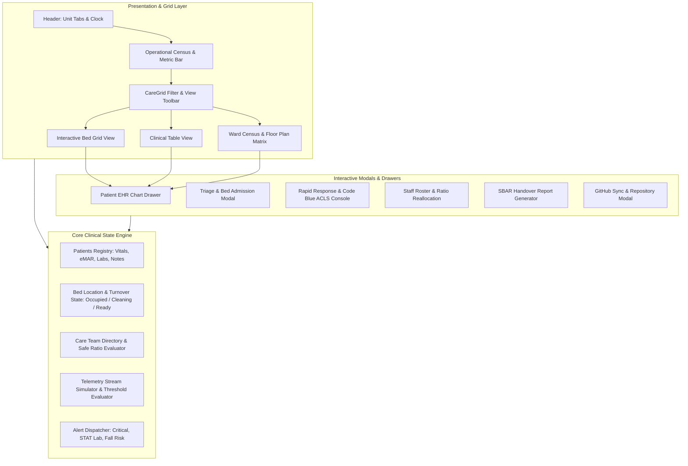
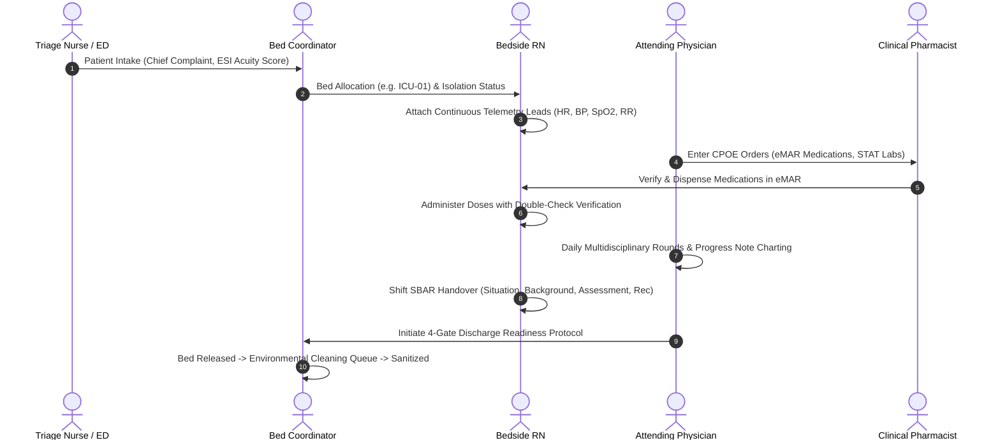
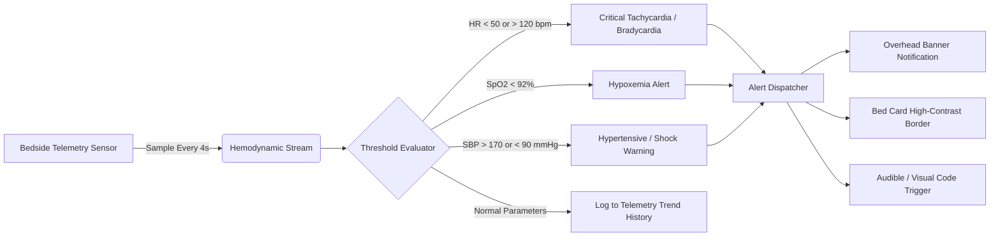

# CareGrid · Clinical Patient & Hospital Unit Coordination System

> **CareGrid** is a high-fidelity, real-time clinical care grid, hemodynamic telemetry monitoring, bed management, electronic medication administration record (eMAR), and multidisciplinary care team coordination platform.

Built for intensive care units (ICU), emergency trauma bays (ED), step-down telemetry units, medical-surgical floors, pediatrics, and post-anesthesia care units (PACU).

---

## Table of Contents
1. [System Architecture Diagram](#1-system-architecture-diagram)
2. [Clinical Care Workflow Diagram](#2-clinical-care-workflow-diagram)
3. [Real-Time Telemetry & Alert Stream Data Flow](#3-real-time-telemetry--alert-stream-data-flow)
4. [Nurse-to-Patient Staffing Ratio Matrix](#4-nurse-to-patient-staffing-ratio-matrix)
5. [Core System Capabilities](#5-core-system-capabilities)
6. [Quickstart & Local Development](#6-quickstart--local-development)
7. [GitHub Repository Setup & Push Guide](#7-github-repository-setup--push-guide)
8. [File Structure](#8-file-structure)

---

## 1. System Architecture Diagram



### ASCII Architecture Overview

```text
+-----------------------------------------------------------------------------------------+
|                                    CAREGRID PLATFORM                                    |
+-----------------------------------------------------------------------------------------+
| [Header] Unit Tabs (ICU | ED | Cardiology | Med-Surg | Peds | PACU) · Live Clock · RRT  |
| [Metrics Bar] Census (10/18) · Critical Acuity (2) · Ratio Status · STAT Labs · ALOS   |
| [Toolbar] Search (MRN/Bed/Dx) · Acuity Filter · Isolation · Fall Risk · eMAR Due Filter |
+-----------------------------------------------------------------------------------------+
                                             |
                   +-------------------------+-------------------------+
                   |                         |                         |
            [Grid Bed Cards]        [Clinical Table View]      [Ward Census Matrix]
            - Bed & Acuity L1-L4    - Tabular Demographics     - Floor Plan Layout
            - Telemetry Strips      - Vitals & Labs Overview   - Turnover & Clean Status
            - eMAR Dose Triggers    - Quick Action Triggers    - 1-Click Bed Admission
                   |                         |                         |
                   +-------------------------+-------------------------+
                                             |
+-----------------------------------------------------------------------------------------+
|                        PATIENT EHR & CLINICAL DETAIL DRAWER                             |
|  - Continuous Telemetry & Vitals History (HR, BP, SpO2, RR, Temp)                       |
|  - Electronic Medication Administration Record (eMAR) with Dose Verification            |
|  - Diagnostic Laboratory Orders (STAT vs Routine) & Reference Ranges                    |
|  - Shift Nursing & Interdisciplinary Care Tasks Checklist                               |
|  - Physician & Nursing Chronological Progress Notes & Clinical Rounds                   |
|  - 4-Gate Discharge Readiness (Clinical, Meds, Transport, Summary)                      |
+-----------------------------------------------------------------------------------------+
                                             |
+-----------------------------------------------------------------------------------------+
|                               CLINICAL AUXILIARY MODALS                                 |
|  [Triage & Admit]  -> Rapid Intake, Bed Allocation, Acuity Scoring, Baseline Vitals     |
|  [Emergency RRT]   -> Code Blue / Rapid Response ACLS Team Dispatch Checklist           |
|  [Staff Roster]    -> ANA / California Safe Staffing Ratios & Patient Reassignment       |
|  [SBAR Generator]  -> Standardized Handover Report (Situation, Background, Assess, Plan)|
|  [GitHub Repo]     -> Repository synchronization and terminal push instructions         |
+-----------------------------------------------------------------------------------------+
```

---

## 2. Clinical Care Workflow Diagram



---

## 3. Real-Time Telemetry & Alert Stream Data Flow



---

## 4. Nurse-to-Patient Staffing Ratio Matrix

CareGrid adheres to mandatory safe staffing regulations (California Title 22 & ANA Guidelines):

| Hospital Unit | Mandatory Ratio (Nurse : Patient) | Target Acuity Level | Rapid Response Escalation |
| :--- | :--- | :--- | :--- |
| **Intensive Care Unit (ICU)** | **1 : 2** (or 1:1 if on ECMO/CRRT) | Level 1 (Critical) | Continuous Telemetry / Immediate RRT |
| **Emergency Department (ED)** | **1 : 3** (Trauma 1:1) | Level 1 - Level 3 | Crash Cart & Bay Resuscitation |
| **Cardiology / Telemetry** | **1 : 4** | Level 2 - Level 3 | Continuous 5-lead rhythm tracking |
| **Medical-Surgical Ward** | **1 : 4** (Max 1:5) | Level 3 - Level 4 | Hourly rounding / Bed alarms |
| **Pediatric Acute Care** | **1 : 3** | Level 2 - Level 4 | Weight-based dosage checks |
| **PACU (Post-Op Phase I)** | **1 : 2** | Level 2 - Level 3 | Aldrete Scoring $\ge 9$ for Step-down |

---

## 5. Core System Capabilities

### 🩺 1. Bed Grid Matrix & Ward Operations
- Multi-unit navigation: **ICU**, **Emergency Bay**, **Cardiology**, **Med-Surg**, **Pediatrics**, **Post-Op PACU**.
- Real-time status tags: Occupied, Terminal Disinfection / Cleaning in progress, Available & Sanitized, Reserved.
- Quick bed action: 1-click admission into any vacant room.

### ⚡ 2. Continuous Hemodynamic Telemetry
- Heart Rate (bpm), Blood Pressure (Systolic/Diastolic), SpO2 Oxygen Saturation, Respiratory Rate, and Temperature.
- Automatic threshold excursion detector highlighting critical vitals with high-contrast color indicators.
- Historical trend log recording vitals trajectory over time.

### 💊 3. Electronic Medication Administration Record (eMAR)
- Active pharmacotherapy orders with dosage, route, frequency, and scheduled time.
- Single-click dose administration with digital nurse signature audit trail and administration timestamp.
- Hold medication workflow with clinical rationale documentation.

### 🧪 4. Diagnostic Laboratories & STAT Tests
- Real-time priority labeling: `STAT`, `Urgent`, `Routine`.
- Critical flag notification for abnormal values (e.g., elevated Troponin, arterial blood gas acidosis, hyperkalemia).

### 📋 5. SBAR Clinical Handover Generator
- One-click structured **SBAR** export (`Situation`, `Background`, `Assessment`, `Recommendation`).
- Copy to clipboard or export directly as `.txt` for shift change handoffs.

### 🚨 6. Emergency ACLS & Rapid Response Console
- Rapid dispatch console for Code Blue and RRT emergencies.
- Interactive checklist covering airway management, IV access, defibrillation, and crash cart readiness.

---

## 6. Quickstart & Local Development

### Prerequisites
- Node.js $\ge 18$
- npm $\ge 9$

### Setup & Run
```bash
# 1. Clone repository
git clone https://github.com/YOUR_USERNAME/CareGrid.git
cd CareGrid

# 2. Install dependencies
npm install

# 3. Start local development server
npm run dev
```

The application will be live at:
- Local: **`http://localhost:5173`** (or `http://localhost:3000`)

---

## 7. GitHub Repository Setup & Push Guide

This repository is fully initialized locally. To push this project to your GitHub account under the repository name **`CareGrid`**, execute either of the following methods in your terminal:

### Option A: Using the GitHub CLI (`gh`) — Recommended

```bash
# 1. Authenticate with GitHub (if not already logged in)
gh auth login

# 2. Create the remote repo 'CareGrid' and push all code in one step:
gh repo create CareGrid --public --source=. --push
```

### Option B: Using Standard Git Remote Commands

```bash
# 1. Verify all files are committed
git status

# 2. Link your remote GitHub repository
# Replace YOUR_USERNAME with your GitHub account username:
git remote add origin https://github.com/YOUR_USERNAME/CareGrid.git

# 3. Set default branch to main and push
git branch -M main
git push -u origin main
```

---

## 8. File Structure

```text
CareGrid/
├── index.html                     # HTML5 entry with Plus Jakarta Sans & JetBrains Mono
├── package.json                   # Dependencies: React 19, Tailwind CSS v4, Lucide, Motion
├── metadata.json                  # Application metadata & capabilities
├── tsconfig.json                  # TypeScript compiler configuration
├── vite.config.ts                 # Vite bundler & Tailwind configuration
├── README.md                      # Comprehensive Architecture, Workflows & Setup
└── src/
    ├── main.tsx                   # React root mount
    ├── index.css                  # Global Tailwind v4 directives & font styling
    ├── App.tsx                    # Main CareGrid container & state orchestration
    ├── types/
    │   └── caregrid.ts            # Clinical domain types (Patients, Vitals, eMAR, Staff)
    ├── data/
    │   └── initialData.ts         # Realistic clinical dataset across hospital units
    └── components/
        ├── Header.tsx             # Unit tabs, clock, telemetry toggle, alert bell
        ├── UnitMetricsBar.tsx     # Census, occupancy %, ratio status, STAT orders
        ├── CareGridToolbar.tsx    # Search, acuity filters, view modes (Grid/Table/Census)
        ├── PatientGridCard.tsx    # Domain-native patient card with telemetry strip
        ├── EmptyBedCard.tsx       # Available/cleaning bed card with 1-click intake
        ├── PatientTableView.tsx   # Dense clinical tabular overview
        ├── BedCensusView.tsx      # Ward floor plan & bed census matrix
        ├── PatientDetailDrawer.tsx# Full EHR: Telemetry, eMAR, Labs, Tasks, Notes, Discharge
        ├── TriageAdmissionModal.tsx# Emergency intake & bed assignment modal
        ├── EmergencyAlertModal.tsx# ACLS Code Blue & Rapid Response console
        ├── StaffRosterModal.tsx   # Nurse-to-patient ratio monitoring & reassignment
        ├── SbarExportModal.tsx    # Joint Commission SBAR handover generator
        └── GitRepoModal.tsx       # GitHub repository push guide & terminal commands
```

---

## License
Apache-2.0 License. Designed for clinical workflows, hospitals, and care facilities.
